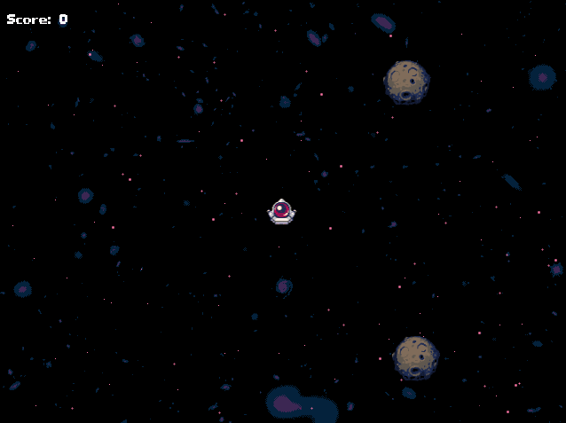
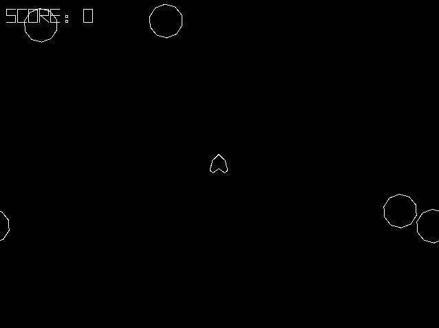

# Asteroids clone

This repo contains my clone of the old Asteroids game published by Atari. Purpose of the repo is to demonstrate my dev skills. That's why I decided to use MonoGame as base - it's enough to build an asteroids clone and not to big as Unity where I wouldn't have a chance to show my skills, because Unity do most of things for you.




# Features
1. Spaceship
2. Planetoids
3. Two renderer system (oldschool polygonal and beatiful sprites, switched by pressing Left control)
4. Score system
5. Shooting by pressing Z
6. Shooting lasers when charged on X
7. UFOs
8. Change resolution by N\M and press F to enter fullscreen

# Source code

Source code is located ander `src` directory and consists of several projects:
1. Asteroids - entry point with monogame game class and Main()
2. Asteroids.Core - contains engine core with ECS system and messanging.
3. Asteroids.Core.Tests - contains unit tests for engine core 
4. Asteroids.Game - contains all game logics
5. MonoGame.SharpMath - it's an empty project that rederences SharpMath2 shared project from submodule

## Dependencies
Most of dependencies are managed by NuGet, but I had to use submodules for SharpLab2, because it doesn't have a publisher nuget package and also I copied Primirives2D class for drawing primitives by the same reaseons. So when cloning repo make sure to put `--recursive` key in clone command.

# Build instructions
First of all - it uses .Net 5. Windows binaries can be found in [releases](https://github.com/YogurtTheHorse/asteroids/releases) in case you don't have an sdk toolkit.

After sdk is isntalled, simply build `Asteroids` project by these commands
```bash
cd src
dotnet build --project Asteroids/Asteroids.csproj
```

# Arhitecure

## ECS
As a main pattern to manage logic I choosed a ECS pattern, so it will be easy to switch rendering system, manage entities and so on. I didn't use MonoGame.Extended ECS system because it's hardcoded inside MonoGame.Extended and I'd had to take all of Extended package with game and it's deadly huge. Unlike Unity DOTS my implementation is pretty slow, because it would make development much longer which I wouldn't like. 

So, the conecpt is pretty simple. Main class of ECS system is world it holds entites and systems. Systems may be of 2 types: draw and update. Entites hold components inside and don't have any game logic inside. Components also don't have any game logic and their purpose is to store data. They must be immutable when possible.

# Dependency Injection
I decided not to use dependency injection, because there are only 3 possible things system may need - world, content manager and json loader. I believe it's easier to write them by hand, but there's no problem with injecting DI into games if it'd be needed.

For communications between systems messaging may be used, so, again, DI isn't too   

## Messaging
As a way of communications between systems I decided to use a very simple message queue with typed observers. Anything can subscribe on messages and anythinh can send them with world instance.

## Physics
Game doesn't have any physics engine, but I used SharpMath2 for collision checking and build colliions handling upon messages system. 

# Credits
Huge thanks to @13x666 who drew all this amazing sprites. 

For sounds I used [sfx pack](https://opengameart.org/content/space-shooter-sound-effects) by Dravenx distributed under CC-BY 3.0 license.
I used Primitives2D code inside which are distributed under zlib License.
For collision detection I used SharpMath2 by Tjstretchalot which is distributed under MIT License
